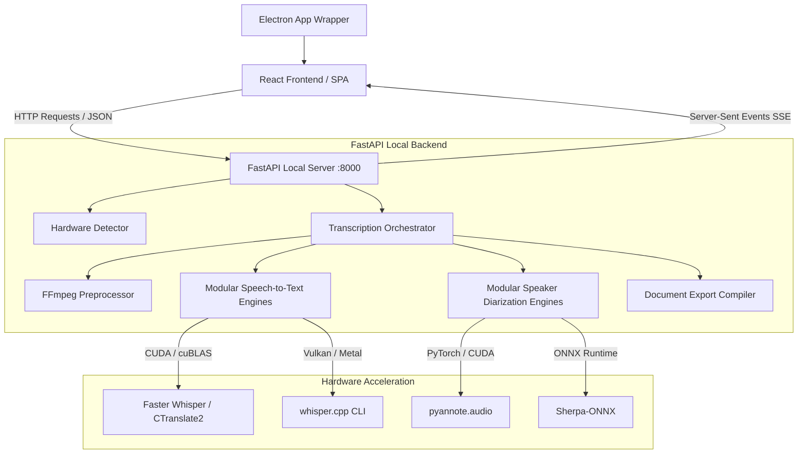

# 🎙️ Onroku AI V2 — System Architecture & Engine Specification

This document provides a detailed overview of the application architecture, system layout, and the specific engines implemented in `app/backend/engines` for audio transcription, speaker diarization, preprocessing, and export.

---

## 1. System Architecture Overview

Onroku AI is designed as a hybrid desktop application combining a rich modern frontend with a hardware-aware Python backend.



### Key Architectural Layers

1. **Frontend Desktop Shell (Electron & React)**:
   - **Electron** provides native windows, file dialogs, directory selectors, and tray support.
   - **React SPA** is a TypeScript-based dashboard that manages transcription jobs, configuration settings, and renders real-time SSE progress updates.

2. **Backend Services (FastAPI & Uvicorn)**:
   - Executes locally on `http://127.0.0.1:8000`.
   - Interfaces directly with Python audio libraries, AI model runtimes, and local hardware detection.
   - Uses a hardware-aware startup flow that determines `device`, `compute_type`, available CPU cores, and GPU acceleration capabilities.

---

## 2. Transcription (Speech-to-Text) Engines

The backend registers engines dynamically from `app/backend/engines/__init__.py`. Each engine is loaded inside a `try/except` block so one failing backend import does not stop the application.

| Engine Name | Backend Module | Underlying Runtime | Usage | Strengths |
| :--- | :--- | :--- | :--- | :--- |
| `whisper` | `app/backend/engines/whisper.py` | `faster_whisper.WhisperModel` | Primary transcription engine for CPU and CUDA devices. | Hardware-aware; supports CUDA, CPU, and mixed compute types with optional quantization. |
| `whisper_cpp` | `app/backend/engines/whisper_cpp.py` | `whisper.cpp` CLI + GGML model files | GPU and CPU transcription via external binary. | Lightweight binary execution and local GGML model download for systems where Python model runtimes are unavailable or suboptimal. |
| `qwen` | `app/backend/engines/qwen.py` | `qwen_asr.Qwen3ASRModel` | Large-context ASR model with semantic transcription capabilities. | Supports GPU/CPU, automatic model selection for `0.6B` or `1.7B`, and can be used when higher-level audio understanding is needed. |

### Transcription Engine Behavior

- `whisper.py` loads `faster_whisper` lazily and sets device/compute parameters based on detected hardware.
- `whisper_cpp.py` executes an external `whisper.cpp` binary and converts its JSON output into the same transcript segment format used by the rest of the pipeline.
- `qwen.py` loads Qwen3-ASR models from local cache or Hugging Face repo IDs and transcribes input audio in a single chunk.

> [!NOTE]
> The application prefers `whisper` via `faster_whisper` when available, falls back to `whisper_cpp` for whisper.cpp-native execution, and supports `qwen` as an alternate ASR engine.

---

## 3. Speaker Diarization Engines

Speaker diarization is handled by separate engine wrappers with independent dependency sets.

| Engine Name | Backend Module | Underlying Runtime | Usage | Strengths |
| :--- | :--- | :--- | :--- | :--- |
| `pyannote` | `app/backend/engines/pyannote.py` | `pyannote.audio` + PyTorch | High-accuracy speaker turn detection. | Powerful neural pipeline for overlap handling and flexible speaker-range settings. Best on GPU or strong CPU systems. |
| `sherpa` | `app/backend/engines/sherpa.py` | `sherpa_onnx` + ONNX models | Offline speaker diarization. | Fast ONNX-based diarization with pre-built segmentation and embedding models. Good for lightweight or CPU-only deployments. |

### Diarization Engine Behavior

- `pyannote.py` loads the `pyannote/speaker-diarization-3.1` pipeline and can use a Hugging Face token from `hf_token.txt` if available.
- `sherpa.py` requires local ONNX model files under `app/models/sherpa-onnx` and builds a `OfflineSpeakerDiarizationConfig` before processing audio.
- Both engines map diarization results back to transcription segments, assigning speaker labels and, when available, word-level speaker blocks.

---

## 4. Preprocessing & Audio Pipeline Engines

Audio is normalized and converted before transcription.

```text
[Raw Audio/Video File]
        │
        ▼ (FFmpeg)
[Mono 16kHz WAV] ──► [Noise Reduction (afftdn)] ──► [Loudness Norm (loudnorm)] ──► [Transcriber]
```

- **FFmpeg** decodes source media into standard audio waveform formats.
- **`afftdn`** applies FFT-based noise reduction for cleaner speech input.
- **`loudnorm`** applies EBU R128 loudness normalization to stabilize volume levels.
- Output is produced as mono 16 kHz PCM WAV, which is the expected input for the transcription engines.

---

## 5. Document & Layout Compilers

Transcription output is compiled into structured export formats.

- **PDF Export**: Uses ReportLab to render transcripts and speaker labels into print-ready PDF documents.
- **Structured Export**: Supports native exports such as `.docx`, `.xlsx`, `.csv`, and `.json` for downstream review or data processing.

---

## 6. Fault Isolation & Self-Healing Architecture

`app/backend/engines/__init__.py` maintains a status map for each engine:

- `whisper`
- `whisper_cpp`
- `qwen`
- `pyannote`
- `sherpa`

If one engine import fails, the rest of the backend still initializes. The frontend uses the health matrix to display only the engines currently available on the host machine.
